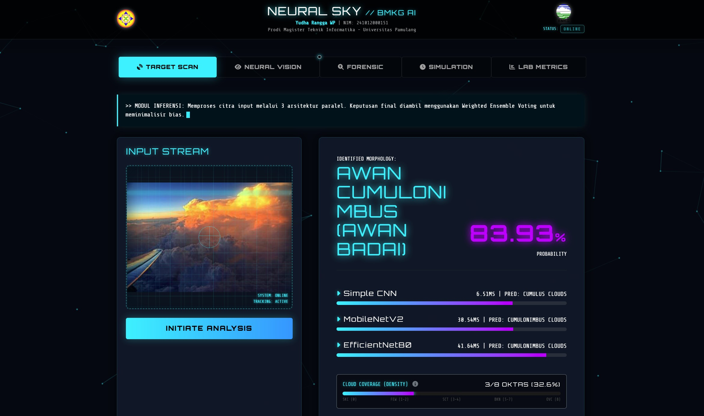
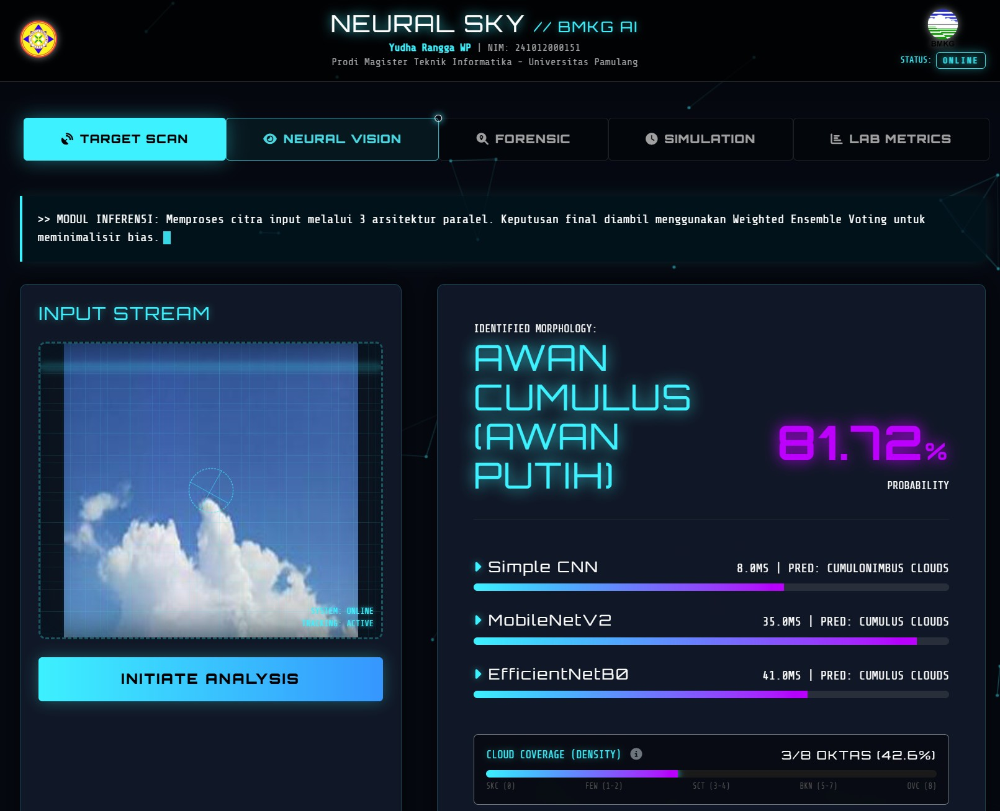
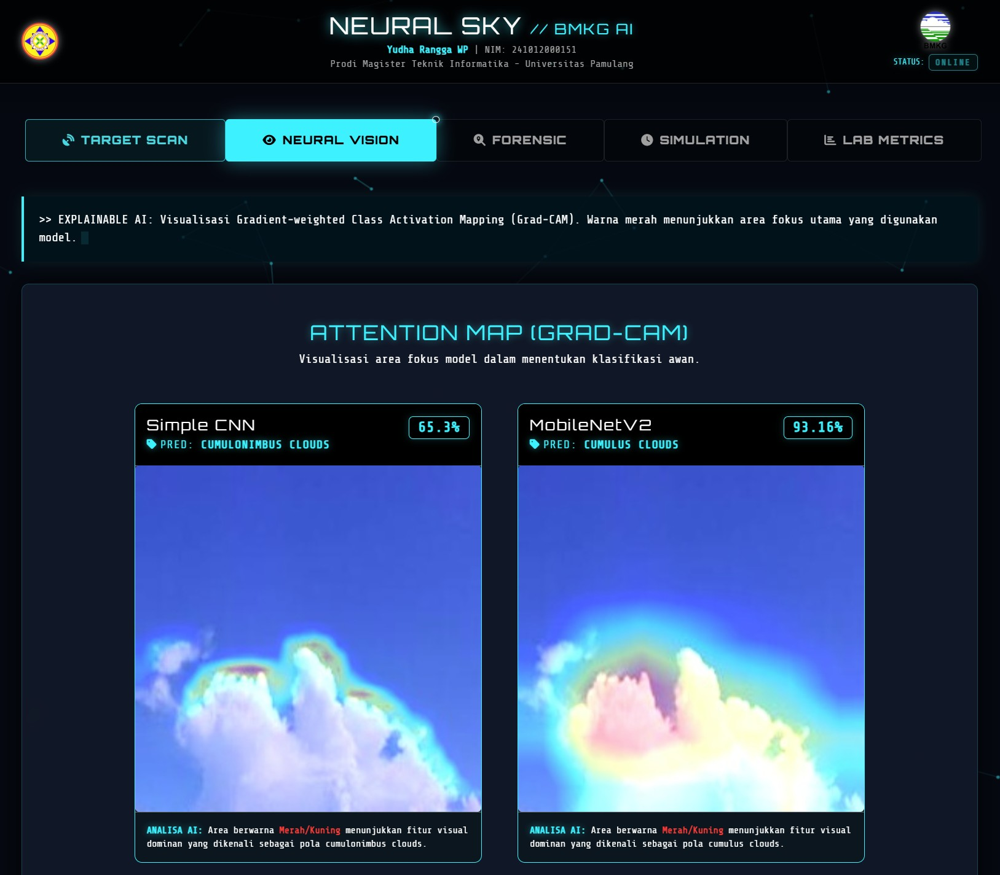
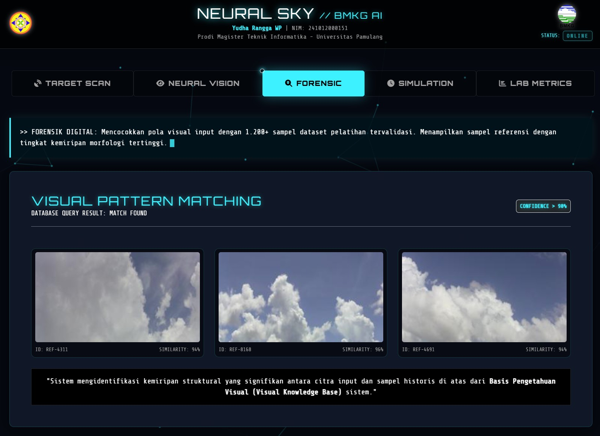
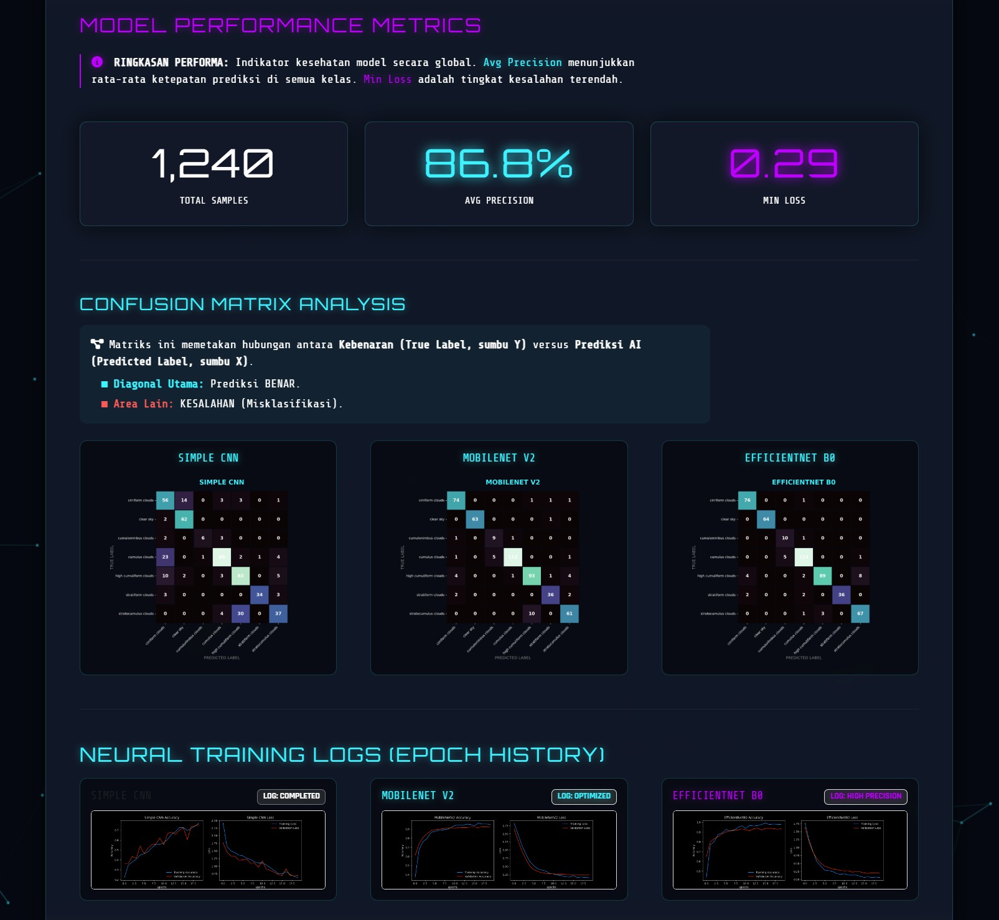
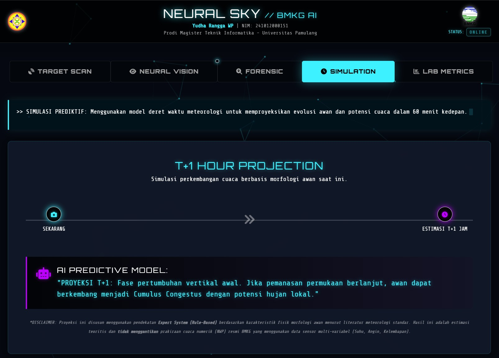

# Neural Sky

Sistem Klasifikasi Awan Hybrid Ensemble dengan Integrasi Explainable AI (XAI) dan Sistem Pakar Meteorologi.

[](https://github.com/yudharangga-hub/NeuralSky/releases)
[](https://www.python.org/)
[](https://pytorch.org/)
[]()

Neural Sky adalah sistem klasifikasi awan berbasis deep learning yang menggabungkan pendekatan hybrid ensemble, interpretabilitas model, estimasi tutupan awan (Oktas), dan simulasi dampak cuaca berbasis aturan meteorologi. Sistem ini dikembangkan untuk mendukung analisis awan secara lebih objektif dan terukur dalam konteks penelitian serta aplikasi meteorologi operasional.

## Overview

Proyek ini mengintegrasikan beberapa komponen utama:

- Hybrid ensemble CNN menggunakan Simple CNN, MobileNetV2, dan EfficientNet-B0
- Weighted Soft Voting untuk kombinasi prediksi model
- Grad-CAM untuk visualisasi area fokus model pada citra awan
- Estimasi Oktas berdasarkan segmentasi citra
- Sistem pakar meteorologi untuk analisis dampak cuaca T+1
- Dashboard web berbasis Flask untuk inferensi dan analisis interaktif

## Feature gallery

| Feature | Preview |
|---|---|
| Dashboard utama |  |
| Scan result |  |
| Grad-CAM / XAI |  |
| Forensic evidence |  |
| Metrics dashboard |  |
| Weather forecast |  |

## Research context

Proyek ini dikembangkan sebagai bagian dari penelitian tesis yang berfokus pada klasifikasi awan dan analisis kondisi meteorologi berbasis citra digital. Tujuan utama penelitian adalah meningkatkan keandalan klasifikasi jenis awan dengan pendekatan deep learning yang dapat diinterpretasikan secara visual dan dikaitkan dengan konteks meteorologi.

## Main features

- Multi-model cloud classification
- Weighted ensemble fusion
- Explainable AI with Grad-CAM
- Cloud coverage estimation (Oktas)
- Weather impact reasoning using expert rules
- Web interface for image upload and prediction
- PDF report generation for decision support

## Dataset

Dataset penelitian terdiri dari beberapa kelas awan utama, meliputi:

- Clear Sky
- Cirriform Clouds
- Cumulonimbus Clouds
- Cumulus Clouds
- High Cumuliform Clouds
- Stratiform Clouds
- Stratocumulus Clouds

Catatan penting: dataset raw dan bobot model tidak disertakan di repository publik karena alasan ukuran, lisensi, dan keamanan. Struktur dataset serta instruksi untuk persiapan data tersedia pada dokumentasi penelitian dan script pelatihan yang ada pada repositori.

## Repository structure

```text
neural-sky/
├── README.md
├── requirements.txt
├── LICENSE
├── app.py
├── train_pytorch.py
├── evaluate_pytorch.py
├── gradcam_pytorch.py
├── impact_logic.py
├── report_generator.py
├── generate_comparison.py
├── generate_oktas_proof.py
├── reconstruct_all_charts.py
├── templates/
├── static/
├── screenshots/
├── docs/
├── src/
├── scripts/
├── results/
├── sample_images/
└── .gitignore
```

## Technology stack

- Python 3.10+
- PyTorch
- TorchVision
- OpenCV
- Flask
- Bootstrap 5
- Matplotlib / Seaborn
- FPDF

## Installation

1. Clone the repository

```bash
git clone https://github.com/yudharangga-hub/NeuralSky.git
cd NeuralSky
```

2. Create a virtual environment

```bash
python -m venv venv
# Windows
venv\Scripts\activate
# Linux/macOS
source venv/bin/activate
```

3. Install dependencies

```bash
pip install -r requirements.txt
```

4. Prepare dataset and model

- Ensure the dataset is prepared according to the directory structure used by the training scripts.
- Ensure model weights are available if you want to run inference without retraining.

5. Run the application

```bash
python app.py
```

Then open the local browser at:

```text
http://127.0.0.1:5000
```

## How to run training and evaluation

```bash
python train_pytorch.py
python evaluate_pytorch.py
```

Optional supporting scripts:

```bash
python generate_comparison.py
python generate_oktas_proof.py
python reconstruct_all_charts.py
```

## Research note

This repository reflects the thesis-version implementation of Neural Sky. For academic reproducibility, the complete source code is maintained in the repository, while large raw data artifacts and trained model assets are intentionally excluded from public GitHub storage to keep the project maintainable and safe for reuse.

## Release version

This repository is intended to be published under a stable thesis release tag, for example:

```text
v1.0-thesis
```

or

```text
thesis-final-2026
```

## License

This project is intended for academic research and educational use. Please refer to the repository license and institutional guidelines before broader reuse or redistribution.

## Contact

For questions related to the implementation or research context, please contact the corresponding author or refer to the associated thesis documentation.

---

This repository is maintained as a research implementation and is designed to support reproducibility, further development, and academic reference.
